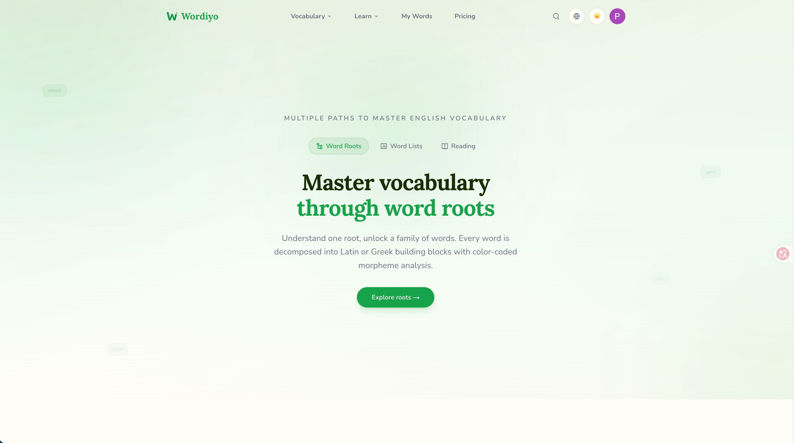

<div align="center">

# Wordiyo

**Master English vocabulary through word roots and etymology.**

[Website](https://wordiyo.com) | [Word Roots](https://wordiyo.com/roots) | [Vocabulary Lists](https://wordiyo.com/vocabulary) | [Learn](https://wordiyo.com/learn)



</div>

## What is Wordiyo?

Wordiyo is a free English vocabulary learning platform that teaches words through their Latin and Greek roots.

Instead of rote memorization, every word is broken down into color-coded morphemes (prefix + root + suffix), revealing the logic behind word formation. Learn one root, understand dozens of related words.

```
Root: duct (to lead)
├── con + duct    → conduct      (lead together)
├── pro + duct    → product      (lead forward)
├── intro + duct  → introduction (lead into)
└── de + duct     → deduct       (lead away)
```

## Features

**Dictionary** - 16,000+ words with bilingual definitions (EN/ZH), IPA pronunciation, TTS audio, collocations, and example sentences

**Word Roots** - 605 Latin & Greek roots with etymology, morpheme decomposition visualization, and Grimm's Law sound change patterns

**Vocabulary Lists** - Curated lists by exam (GRE, TOEFL, IELTS, SAT, CET-4/6), CEFR level (A1-C2), and frequency (NGSL, AWL)

**Reading** - Articles with inline vocabulary annotations, bilingual translation toggle, and side vocabulary panel

**Personal Tracking** - Google OAuth login, mastery tracking (4 levels), and personal vocabulary book

**Bilingual** - All content available in English + Chinese, with instant language switching

## Data

| | Count |
|---|---|
| Words | 16,000+ |
| Word Roots | 605 |
| Affixes | 163 |
| Example Sentences | 69,150 |
| Exam Tags | 10 (GRE, TOEFL, IELTS, SAT, CET-4/6, etc.) |
| Semantic Domains | 45+ |

## Tech Stack

- **Framework**: Next.js (App Router, SSR/ISR)
- **Language**: TypeScript (strict mode)
- **Styling**: Tailwind CSS with CSS variable design tokens
- **Database**: Supabase (PostgreSQL)
- **Auth**: Google OAuth via Supabase Auth
- **Deployment**: Vercel
- **Fonts**: Lora (headings) + Nunito (body)

## Development

```bash
pnpm install     # Install dependencies
pnpm dev         # Start dev server (port 3001)
pnpm build       # Production build
pnpm type-check  # TypeScript validation
pnpm lint        # ESLint
```

## License

MIT License - see [LICENSE](LICENSE) for details.

## Links

- Website: [wordiyo.com](https://wordiyo.com)
- Contact: hello@wordiyo.com
